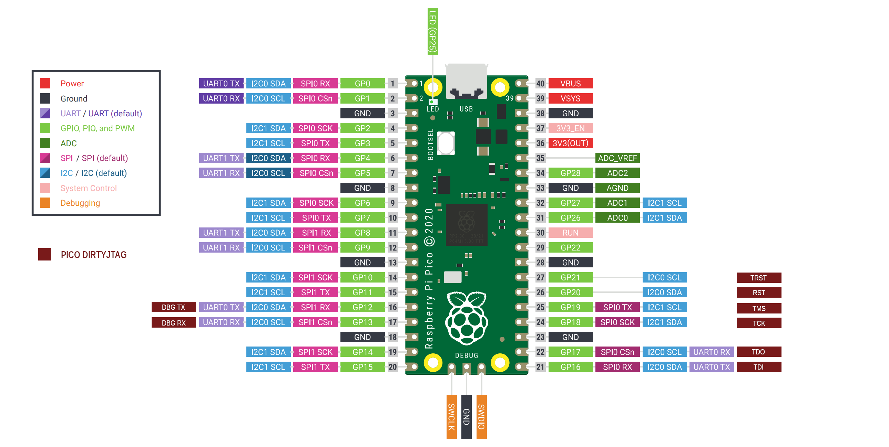

# PICO-DIRTYJTAG

This code allows the Pico to become a JTAG cable.  It uses the PIO unit to produce and capture the JTAG signals.  This is a port of the excellent [DirtyJtag project](https://github.com/jeanthom/DirtyJTAG)

An additional feature provides a bridge to an external UART.  This is often useful when the target provides debugging output or a console over a UART.

## Pinout




| Pin name | GPIO   | Pico Pin Number |
|:---------|:-------| -          |
| TDI      | GPIO16 | 21         |
| TDO      | GPIO17 | 22         |
| TCK      | GPIO18 | 24         |
| TMS      | GPIO19 | 25         |
| RST      | GPIO20 | 26         |
| TRST     | GPIO21 | 27         |
| DBG TX   | GPIO12 | 16         |
| DBG RX   | GPIO13 | 17         |


## Configuration

Other configurations and RP2040 boards are supported.  

In `dirtyJtagConfig.h`, select the board you want to use, or define a new one.

``` C
#define BOARD_TYPE BOARD_PICO
//#define BOARD_TYPE BOARD_ADAFRUIT_ITSY
//#define BOARD_TYPE BOARD_SPOKE_RP2040
//#define BOARD_TYPE BOARD_WERKZEUG
//#define BOARD_TYPE BOARD_QMTECH_RP2040_DAUGHTERBOARD
//#define BOARD_TYPE BOARD_RP2040_ZERO
```

The following values control where the code expects to find functionality.  Of course, not all pins can can be used for all functions.  Take care, especially with the UART pins, to ensure compatibility.

``` C
#define PIN_TDI 16 
#define PIN_TDO 17
#define PIN_TCK 18
#define PIN_TMS 19
#define PIN_RST 20
#define PIN_TRST 21

#define LED_INVERTED   0
#define PIN_LED_TX     25
#define PIN_LED_ERROR  25
#define PIN_LED_RX     25

#define PIN_UART_INTF_COUNT 2
#define PIN_UART0 uart0
#define PIN_UART0_TX    12
#define PIN_UART0_RX    13
#define PIN_UART1 uart1
#define PIN_UART1_TX    4
#define PIN_UART1_RX    5
```

If the CDC to UART bridge is not required, or interfers in any way, it can be disabled by setting `USB_CDC_UART_BRIDGE` to 0

``` C
#define USB_CDC_UART_BRIDGE  0
```
You can define 1 or 2 bridges by setting `PIN_UART_INTF_COUNT` appropriately
``` C
#define PIN_UART_INTF_COUNT 2
```
See the `dirtyJtagConfig.h` file for these and other configuration options.

## Building pico-dirtyJtag

Follow [the instructions](https://github.com/raspberrypi/pico-sdk) for installing the official Raspberry Pi Pico SDK, then clone this repository and use the following commands:

```
mkdir -p build
cd build
cmake ..
make
```

If everything succeeds you should have a `dirtyJtag.uf2` file that you can directly upload to the Pi Pico.

## JTAG Usage

Once the board is running `pico-dirtyJtag` and connected to your host you will see a new USB device

```
$ lsusb
...
Bus 003 Device 112: ID 1209:c0ca Generic Jean THOMAS DirtyJTAG
...
```

You can connect to JTAG functionality using `UrJTAG`, `openFPGALoader` or other JTAG tools.  Depending on how your system is set up, you may have to run these commands as root.

For example, using `openFPGALoader`, the following command will connect to the Pico and read the IDCODE from the attached device:

```
> sudo openFPGALoader --cable dirtyJtag --detect
Jtag frequency : requested 6000000Hz -> real 6000000Hz
index 0:
	idcode 0x1112043
	manufacturer lattice
	family ECP5
	model  LFE5UM-45
	irlength 8
```

`UrTag` use is similar:

```
$ sudo jtag

UrJTAG 2021.03 #d9a2943f
Copyright (C) 2002, 2003 ETC s.r.o.
Copyright (C) 2007, 2008, 2009 Kolja Waschk and the respective authors

UrJTAG is free software, covered by the GNU General Public License, and you are
welcome to change it and/or distribute copies of it under certain conditions.
There is absolutely no warranty for UrJTAG.

warning: UrJTAG may damage your hardware!
Type "quit" to exit, "help" for help.

jtag> cable dirtyjtag
jtag> detect
IR length: 8
Chain length: 1
Device Id: 01000001000100010010000001000011 (0x41112043)
  Manufacturer: Lattice Semiconductors (0x043)
  Part(0):      LFE5U-45F-CABGA256 (0x1112)
  Stepping:     0
  Filename:     /usr/local/share/urjtag/lattice/lfe5u-45f-cabga256/lfe5u-45f-cabga256
jtag> 
```

## Debug UART

Once connected, a new port appears as an additional USB interface.  This port can be opened from a terminal emulation program or by custom code.

```
$ ls -la /dev/tty*
...
crw-rw---- 1 root  dialout 166,  0 May 28 08:25 /dev/ttyACM0
...
```
